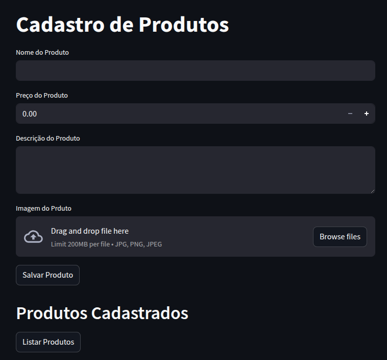
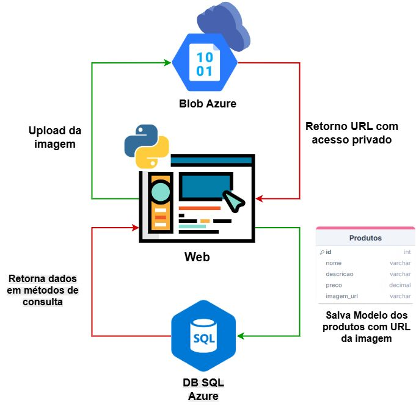

`Project: Comunicate_With_AzureBlob_Python`

`Start Project - 14/04/2024`

Azure communication project between AzureDb and Azure Blob with python code language.




## Members
* Amaury Vinícius Costa Magno

## Practitioner

* Henrique Eduardo Souza - Microsoft MVP, Microsoft

## Project Startup Instructions
  To startup the project you need to clone this GitHub repository using the link:

#### Clone HTTPS GitHub Project:
```bash
git https://github.com/AmauryMagno/Comunicate_With_AzureBlob_Python.git
```

#### Install Dependencies:
Execute and install project dependencies through the requirements.txt file in your virtual enviroment(recomended), or in your local environment

```bash
pip install -r requirements.txt
```

# Documentation

<ol>
<li><a href="docs/01-Context Documentation.md"> Context Documentation</a></li>
<li><a href="docs/02-Project Specification.md"> Project Specification</a></li>
<li><a href="docs/03-Experience And Learning.md"> Experience And Learning</a></li>
</ol>
